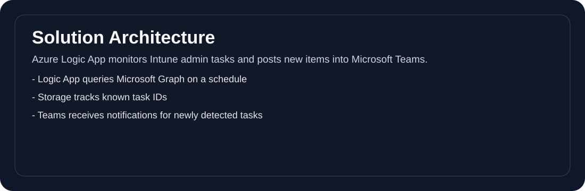
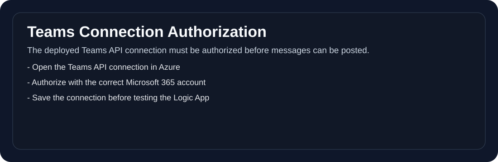
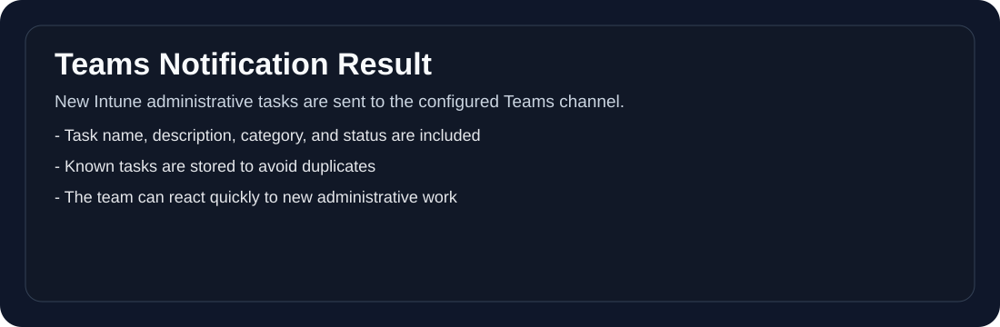

# Intune Administrative Tasks Monitor: Automatic Teams Notifications for New Tasks

In this article, I'll show you how to set up an Azure Logic App that automatically detects new Intune Administrative Tasks and sends notifications to a Microsoft Teams channel.

## Overview

The solution consists of the following components:

- **Azure Logic App**: Queries the Microsoft Graph API every 5 minutes
- **Azure Storage Account**: Stores known task IDs to avoid duplicate notifications
- **Microsoft Teams**: Receives notifications about new Administrative Tasks



## Prerequisites

- Azure subscription
- Microsoft 365 license with Intune
- Permissions to create Azure resources
- Microsoft Teams team with a channel for notifications

## Step 1: Get Teams Group ID and Channel ID

Before starting the deployment, you need the IDs of your Teams channel.

1. Open **Microsoft Teams**
2. Right-click on the **Team** → "Get link to team"
3. The URL contains: `groupId=<YOUR-GROUP-ID>`
4. Right-click on the **Channel** → "Get link to channel"
5. The URL contains the Channel ID (starts with `19:...`)

Example URL:
```
https://teams.microsoft.com/l/channel/19%3A...%40thread.tacv2/ChannelName?groupId=XXXXXXXX-XXXX-XXXX-XXXX-XXXXXXXXXXXX&tenantId=...
```
- `groupId` = Teams Group ID
- The part after `/channel/` (URL-decoded) = Channel ID

## Step 2: Deploy to Azure

Click the button below to deploy the solution directly to your Azure subscription:

[](https://portal.azure.com/#create/Microsoft.Template/uri/https%3A%2F%2Fraw.githubusercontent.com%2FJayRHa%2FAdminTaskNotification%2Fmain%2Fazuredeploy.json)

Fill in the required parameters:

| Parameter | Description |
|-----------|-------------|
| **Logic App Name** | Name of the Logic App (default: `intune-admin-task-monitor`) |
| **Teams Group ID** | Your Teams Group ID from Step 1 |
| **Teams Channel ID** | Your Channel ID from Step 1 |
| **Recurrence Interval** | Interval in minutes for checking new tasks (default: 5) |

> **Note:** Storage Account Name and Location are automatically configured based on the Resource Group.

After clicking **"Review + create"** and then **"Create"**, wait for the deployment to complete.

**Important**: Note the `logicAppManagedIdentityPrincipalId` from the deployment outputs - you'll need it in Step 4!

## Step 3: Authorize the Teams Connection

After deployment, the Teams API connection must be manually authorized:

1. Go to the [Azure Portal](https://portal.azure.com)
2. Navigate to your Resource Group
3. Click on the **"teams"** resource (Type: API Connection)
4. Click **"Edit API connection"** in the left menu
5. Click **"Authorize"**
6. Sign in with your Microsoft 365 account
7. Click **"Save"**



## Step 4: Grant Graph API Permissions

The Logic App needs permissions to query Intune Administrative Tasks. This is done through the Managed Identity.

### Using PowerShell and Microsoft Graph

1. Install the Microsoft Graph PowerShell module (if not already installed):
   ```powershell
   Install-Module Microsoft.Graph -Scope CurrentUser
   ```

2. Run the following script (replace the Principal ID with the value from Step 2):
   ```powershell
   # Connect to Microsoft Graph
   Connect-MgGraph -Scopes "Application.Read.All","AppRoleAssignment.ReadWrite.All"

   # The Principal ID of the Logic App Managed Identity (from deployment output)
   $ManagedIdentityPrincipalId = "YOUR-PRINCIPAL-ID-HERE"

   # Find Microsoft Graph Service Principal
   $GraphAppId = "00000003-0000-0000-c000-000000000000"
   $GraphServicePrincipal = Get-MgServicePrincipal -Filter "appId eq '$GraphAppId'"

   # Find the required App Role
   $AppRoleName = "DeviceManagementManagedDevices.Read.All"
   $AppRole = $GraphServicePrincipal.AppRoles | Where-Object { $_.Value -eq $AppRoleName }

   # Assign the permission
   New-MgServicePrincipalAppRoleAssignment `
       -ServicePrincipalId $ManagedIdentityPrincipalId `
       -PrincipalId $ManagedIdentityPrincipalId `
       -ResourceId $GraphServicePrincipal.Id `
       -AppRoleId $AppRole.Id

   Write-Host "Permission '$AppRoleName' has been successfully assigned!" -ForegroundColor Green
   ```

### Verify the Permission

You can verify that the permission was assigned correctly:

1. Go to the [Azure Portal](https://portal.azure.com)
2. Navigate to **Microsoft Entra ID** > **Enterprise Applications**
3. Change the filter to **"Managed Identities"**
4. Search for your Logic App
5. Click **"Permissions"** - you should see `DeviceManagementManagedDevices.Read.All` listed

## Step 5: Test the Logic App

1. Go to the Azure Portal
2. Open your Logic App **"intune-admin-task-monitor"**
3. Click **"Run Trigger"** > **"Run"**
4. Wait for the run to complete
5. Click on the run to see the details

On the first run, all current Administrative Tasks are stored as "known". From the next run onwards, you'll only receive notifications for new tasks.

## Step 6: Result

When a new Administrative Task is created in Intune, you'll receive a notification in your Teams channel:



The message contains:
- Task name
- Description
- Category
- Status
- Creation date
- Task ID

## Troubleshooting

### Logic App Fails with 401/403

**Problem**: The HTTP action receives an authentication error.

**Solution**: Verify that the Graph API permissions were assigned correctly (Step 4).

### No Teams Message is Sent

**Problem**: The Logic App run is successful, but no message appears in Teams.

**Solutions**:
1. Verify that the Teams connection is authorized (Step 3)
2. Verify that the Group ID and Channel ID are correct
3. Ensure that the bot is allowed to post messages in the channel

### Blob Storage Error

**Problem**: The Logic App cannot access the Blob Storage.

**Solution**: Check the Azure Blob connection:
1. Go to the API Connection **"azureblob"**
2. Click **"Edit API connection"**
3. Verify that the connection is valid

## Cost

The solution incurs minimal costs:

| Resource | Estimated Cost/Month |
|----------|---------------------|
| Logic App (Standard) | ~$1-2 (with 5-min interval) |
| Storage Account (LRS) | < $0.10 |
| **Total** | **~$2-3** |

## Extension Options

- **Email Notifications**: Add an Office 365 Outlook action
- **Adaptive Cards**: Design the Teams message as an interactive Adaptive Card
- **Filters**: Filter by specific task categories or status
- **Dashboard**: Create a Power BI dashboard for task analytics

## Conclusion

With this solution, you'll never miss new Intune Administrative Tasks again. The automatic notifications in Teams enable quick response to new tasks and improve collaboration within the IT team.

---

**Further Reading**:
- [Microsoft Graph API - Administrative Tasks](https://docs.microsoft.com/en-us/graph/api/resources/intune-remoteassistance-devicemanagementreports?view=graph-rest-beta)
- [Azure Logic Apps Documentation](https://docs.microsoft.com/en-us/azure/logic-apps/)
- [Managed Identities for Azure Resources](https://docs.microsoft.com/en-us/azure/active-directory/managed-identities-azure-resources/overview)
